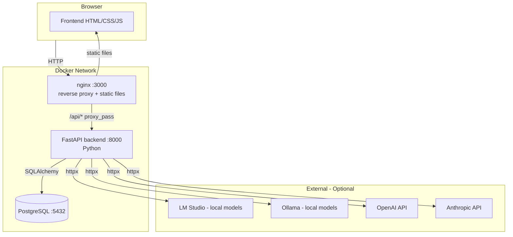
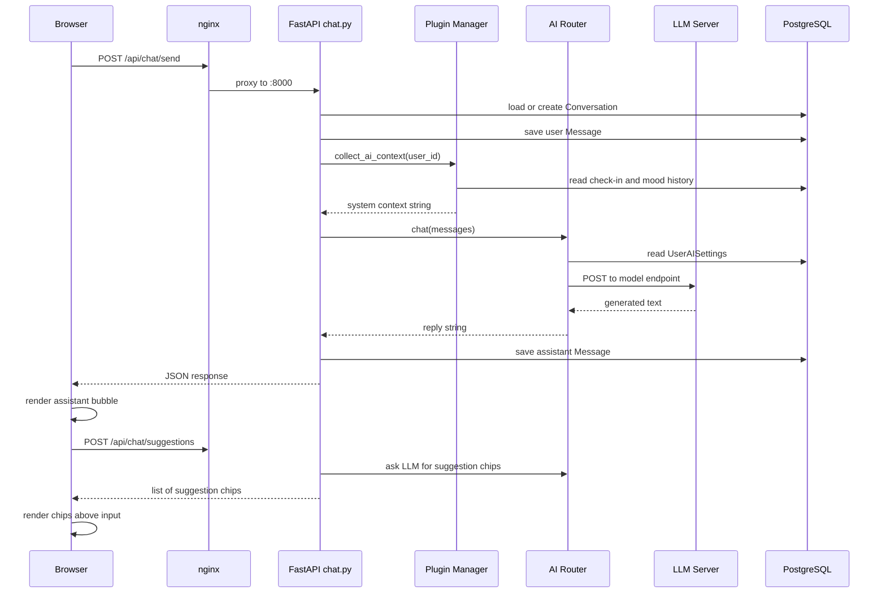
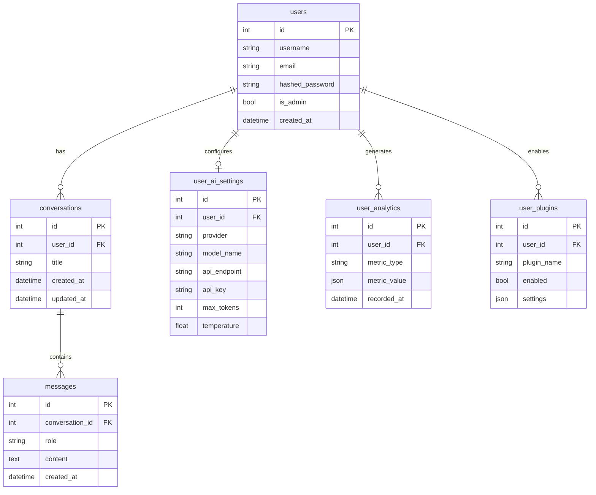
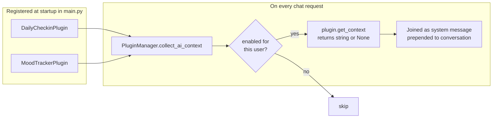
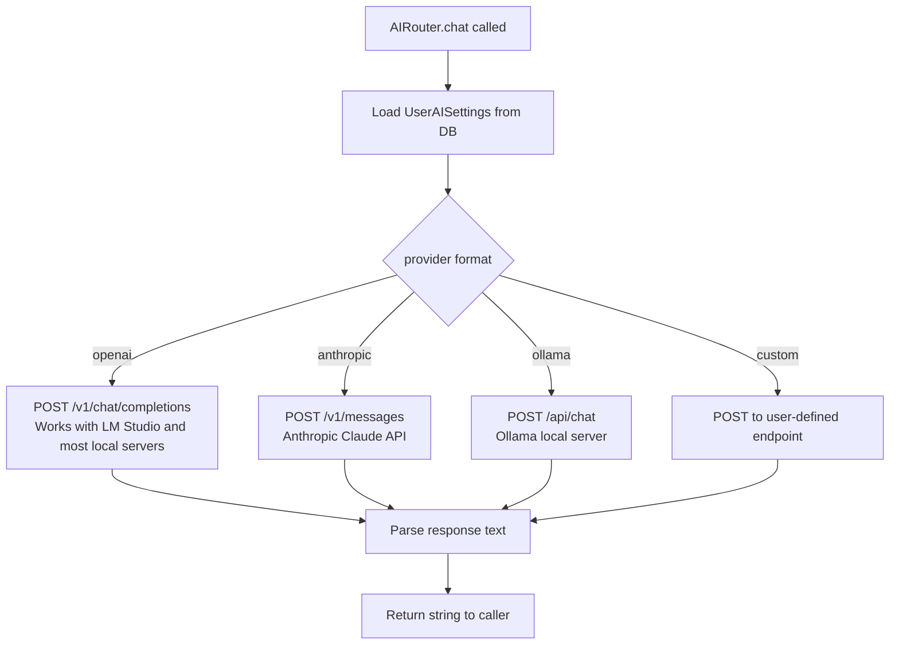

# AccessBot

A self-hosted AI companion designed to support people with disabilities.
AccessBot provides daily mood check-ins, wellness insights, a resource library,
smart proactive suggestions, and a persistent AI conversation -- all running
locally on your own hardware with no dependency on external services.

---

## Table of Contents

1. [What It Does](#what-it-does)
2. [Architecture Overview](#architecture-overview)
3. [Request Flow: Chat Message](#request-flow-chat-message)
4. [Database Schema](#database-schema)
5. [Plugin System](#plugin-system)
6. [AI Provider Support](#ai-provider-support)
7. [Project Structure](#project-structure)
8. [Getting Started](#getting-started)
9. [Configuration Reference](#configuration-reference)
10. [How to Make Common Changes](#how-to-make-common-changes)
11. [Roadmap](#roadmap)

---

## What It Does

| Feature | Description |
|---|---|
| AI Chat | Persistent multi-turn conversations with an LLM of your choice |
| Daily Check-in | Log your mood and a short note once per day |
| Wellness Insights | Charts showing mood trends, streaks, and weekly summaries |
| Smart Suggestions | Proactive chips offered after each AI reply |
| Resource Library | Curated coping strategies and accessibility tips |
| Site Navigator | Floating help widget on every page |
| Voice Input | Microphone support in the chat interface |
| Accessibility | Four colour themes, font zoom, line/letter spacing, focus ring |

---

## Architecture Overview

The application runs as three Docker containers on an internal bridge network.
No cloud infrastructure is required.



The nginx container serves the frontend static files and proxies all `/api/*`
requests to the Python backend. The browser only ever contacts port 3000.

---

## Request Flow: Chat Message

This diagram traces a message from Send button to rendered reply.



---

## Database Schema

Tables are created automatically on first startup. No manual migrations are
needed for a fresh install.



---

## Plugin System

Plugins inject context into every AI conversation silently, without the user
needing to repeat themselves each session.



**How to add a new plugin:**

1. Create `backend/app/plugins/your_plugin/plugin.py`
2. Write a class that extends `BasePlugin`
3. Implement `get_context(user_id, db)` -- return a string or `None`
4. Register an instance in `backend/app/main.py`:

```python
from app.plugins.your_plugin.plugin import your_plugin_instance
plugin_manager.register(your_plugin_instance)
```

---

## AI Provider Support

All four provider formats are handled in `backend/app/services/ai/generic.py`.



The HTTP timeout is 10 seconds to connect and 300 seconds to read.
A 70B local model has up to 5 minutes to finish generating before timing out.

---

## Project Structure

```
AccessBot/
|-- docker-compose.yml          Starts all three containers
|-- nginx.conf                  Reverse proxy: /api/* -> backend :8000
|-- .env.example                Copy to .env and fill in real values
|
|-- backend/
|   |-- Dockerfile
|   |-- requirements.txt
|   +-- app/
|       |-- main.py             FastAPI app -- registers all routers
|       |-- config.py           Reads environment variables
|       |-- core/
|       |   |-- auth.py         JWT token validation (get_current_user)
|       |   |-- database.py     SQLAlchemy engine and session factory
|       |   +-- security.py     Password hashing (bcrypt)
|       |-- models/             SQLAlchemy table definitions
|       |   |-- user.py
|       |   |-- conversation.py
|       |   |-- settings.py
|       |   +-- plugin.py
|       |-- routers/            One file per feature area
|       |   |-- auth.py         /auth/login  /auth/register  /auth/me
|       |   |-- chat.py         /chat/send  /chat/conversations
|       |   |-- suggestions.py  /chat/suggestions (smart chips)
|       |   |-- plugins.py      /plugins/checkin  /plugins/mood
|       |   |-- analytics.py    /analytics/insights
|       |   |-- voice.py        /voice/transcribe  /voice/settings
|       |   +-- admin.py        /admin/test  /admin/ai-settings
|       |-- services/
|       |   +-- ai/
|       |       |-- router.py   Picks the right provider from DB settings
|       |       +-- generic.py  All four LLM HTTP format handlers + timeout
|       +-- plugins/
|           |-- base_plugin.py  Abstract base all plugins extend
|           |-- manager.py      Registry: register, enable/disable, collect
|           |-- daily_checkin/
|           |   +-- plugin.py
|           +-- mood_tracker/
|               +-- plugin.py
|
+-- frontend/
    |-- index.html              Main chat page
    |-- checkin.html            Daily mood check-in
    |-- insights.html           Wellness charts and statistics
    |-- resources.html          Resource library
    |-- settings.html           AI model and account configuration
    |-- manifest.json           PWA manifest
    |-- sw.js                   Service worker for offline support
    |-- css/
    |   |-- style.css           Main dark theme and all core components
    |   |-- accessibility.css   Colour themes, font zoom, focus overrides
    |   |-- checkin.css
    |   |-- insights.css
    |   |-- settings.css
    |   +-- helpbot.css         Site navigator widget
    +-- js/
        |-- app.js              Chat logic, auth, suggestions, breathing modal
        |-- checkin.js
        |-- insights.js
        |-- resources.js
        |-- settings.js
        |-- voice.js            Microphone recording and speech-to-text
        |-- accessibility.js    Theme switcher and a11y controls
        +-- helpbot.js          Site navigator widget (no backend required)
```

`postgres_data/` is excluded from git. It is a Docker bind-mount that holds
all live database files.

---

## Getting Started

### Requirements

- Docker and Docker Compose v2
- A local LLM server (LM Studio, Ollama) or an API key for OpenAI or Anthropic

### First Run

```bash
# 1. Clone the repository
git clone https://github.com/your-username/accessbot.git
cd accessbot

# 2. Create the directory Docker will use for the database
mkdir -p postgres_data

# 3. Start all containers (first build takes 1-2 minutes)
docker compose up -d

# 4. Open the app in your browser
#    http://localhost:3000
#
#    The first account you register becomes the admin.
#    Subsequent registration is automatically disabled.
```

### Connecting a Local LLM (LM Studio example)

1. Start LM Studio and load a model
2. Enable the Local Server in LM Studio (default port 1234)
3. In AccessBot, open Settings and set:
   - Provider: `openai`
   - API Endpoint: `http://host.docker.internal:1234`
   - Model Name: the exact model name shown in LM Studio
   - API Key: any non-empty value (LM Studio does not validate it)

`host.docker.internal` resolves to your host machine from inside Docker.
If it does not resolve on your system, use your LAN IP address instead.

### Updating the App

```bash
# Pull the latest code
git pull

# Rebuild and restart
docker compose up -d --build
```

---

## Configuration Reference

Copy `.env.example` to `.env` before deploying outside a local network.

| Variable | Default | Notes |
|---|---|---|
| `DATABASE_URL` | postgres://accessbot:... | Full connection string |
| `SECRET_KEY` | dev-secret-key | Change before going to production |
| `ALGORITHM` | HS256 | JWT signing algorithm |
| `ACCESS_TOKEN_EXPIRE_MINUTES` | 30 | Session length |
| `DEBUG` | True | Set False in production |
| `CORS_ORIGINS` | localhost:3000 | Comma-separated allowed origins |

To use a `.env` file, add `env_file: .env` to the backend service block in
`docker-compose.yml`.

---

## How to Make Common Changes

### Add a new page

1. Copy an existing page file, e.g. `cp frontend/checkin.html frontend/mypage.html`
2. Create `frontend/js/mypage.js` for the page logic
3. Create `frontend/css/mypage.css` if needed (link it in the HTML head)
4. Add a nav link to the new page in all other HTML files
5. Add the page to the `PAGES` and `INTENTS` dictionaries in
   `frontend/js/helpbot.js` so the site navigator widget knows about it

### Add a new API endpoint

1. Open the relevant router in `backend/app/routers/`
2. Add a function decorated with `@router.get`, `@router.post`, etc.
3. The backend reloads automatically -- no restart needed

If you need a completely new router file:

```python
# backend/app/main.py -- add these two lines
from app.routers import your_module
app.include_router(your_module.router, prefix="/your-prefix", tags=["YourTag"])
```

### Change the visual theme

All CSS custom properties are defined in the `:root` block at the top of
`frontend/css/style.css`. The four named themes are defined in
`frontend/css/accessibility.css` under `[data-theme="name"]` selectors.
Adding a fifth theme requires adding a button in the HTML and a matching
CSS block.

### Change the LLM timeout

Edit the `_LLM_TIMEOUT` constant in
`backend/app/services/ai/generic.py`:

```python
_LLM_TIMEOUT = httpx.Timeout(connect=10.0, read=300.0, write=30.0, pool=5.0)
```

`read` is the most important value. Increase it for very large local models.

### Add a new plugin

See the Plugin System section above.

---

## Security Notes

- The `SECRET_KEY` in `docker-compose.yml` is a development default.
  Change it before exposing the app on any network outside your home.
- The PostgreSQL password is also a development default.
  Change `POSTGRES_PASSWORD` if port 5432 is reachable externally.
- `postgres_data/` contains all user data in plain PostgreSQL format.
  It is excluded from git. Do not commit it and do not expose it.
- API keys stored in Settings are saved in the `user_ai_settings` table.
  They are not encrypted at rest. Keep AccessBot on a private network.

---

## Roadmap

- [ ] Multi-user admin dashboard with anonymised aggregate wellness data
- [ ] Goal tracking plugin
- [ ] Export personal data as CSV or JSON
- [ ] Browser push notifications for daily check-in reminders
- [ ] Unit and integration test suite


